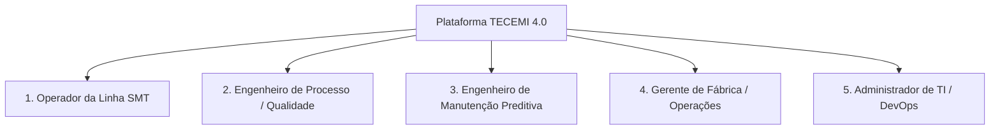
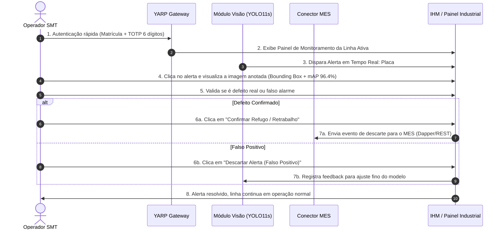
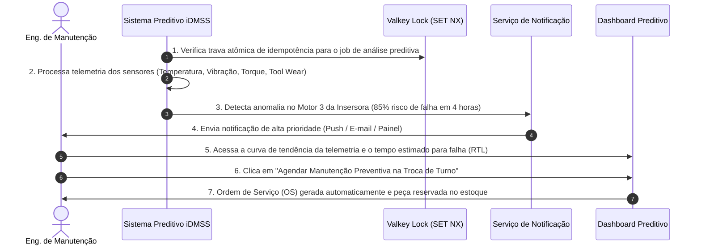
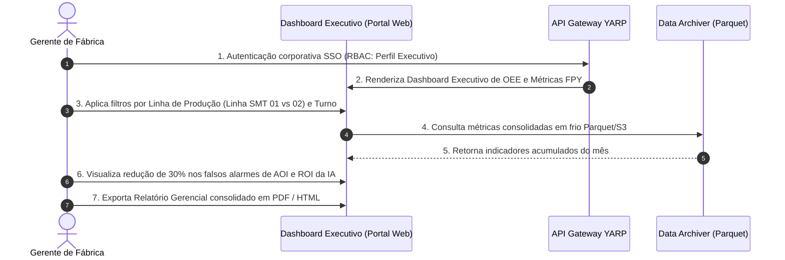
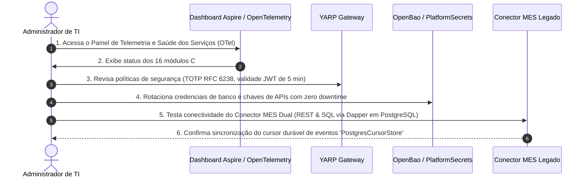

# Mapeamento Completo de Fluxos de Usuário (User Flows) — TECEMI 4.0

Este documento apresenta o mapeamento detalhado dos **fluxos de trabalho e experiência do usuário (User Flows)** para todas as personas que interagem com a plataforma **TECEMI 4.0** na linha de montagem industrial SMT (*Surface Mount Technology*).

---

## 👤 Mapeamento de Personas da Plataforma



---

## 🛠️ 1. Operador da Linha SMT (Operador de Produção & Inspeção)

### **Perfil & Objetivos:**
Atua diretamente no chão de fábrica acompanhando as máquinas SPI (*Solder Paste Inspection*), Pick-and-Place e AOI (*Automated Optical Inspection*). Necessita de alertas visuais rápidos, sem atrito, com tomadas de decisão imediatas sobre placas defeituosas.

### **Fluxo de Trabalho Passo a Passo:**



---

## 🔬 2. Engenheiro de Processo e Qualidade

### **Perfil & Objetivos:**
Responsável por investigar as causas raízes dos defeitos recorrentes de soldagem e desvios de processo, aplicando a metodologia Ishikawa (6M) para evitar parada de linha e aplicar ações corretivas.

### **Fluxo de Trabalho Passo a Passo:**

```mermaid
sequenceDiagram
    autonumber
    actor ENG as Eng. de Processo
    participant UI as Portal de Diagnóstico
    participant KNOW as Knowledge.Api (pgvector)
    participant LOGIC as Motor Ishikawa (6M)
    participant CHAT as Assistente MCP / Chatbot

    ENG->>UI: 1. Acessa o Portal e identifica pico de defeito de "Ponte de Solda" (Bridging)
    ENG->>CHAT: 2. Pergunta ao Assistente: "Quais as causas raízes para ponte de solda na insersora 02?"
    CHAT->>KNOW: 3. Consulta vetorial HNSW em pgvector por histórico de RNCs similares
    CHAT->>LOGIC: 4. Executa consulta GraphQL 'avaliarRegrasIshikawa'
    LOGIC-->>CHAT: 5. Retorna Grafo 6M (Máquina: Pressão do Squeegee alta; Material: Viscosidade da pasta baixa)
    CHAT->>UI: 6. Exibe Diagrama Ishikawa com Árvore de Explicação (XAI) e ranking de probabilidades
    ENG->>UI: 7. Seleciona a Ação Corretiva: "Ajustar viscosidade da pasta no lote B-402"
    ENG->>UI: 8. Registra o Relatório de Não Conformidade (RNC) e envia para homologação
```

---

## ⚡ 3. Engenheiro de Manutenção Preditiva

### **Perfil & Objetivos:**
Monitora a saúde mecânica e elétrica dos equipamentos SMT (forno de reflow, motores de Pick-and-Place) para atuar antes que ocorra uma quebra não planejada.

### **Fluxo de Trabalho Passo a Passo:**



---

## 📈 4. Gerente de Fábrica / Diretor de Operações

### **Perfil & Objetivos:**
Necessita de visão macro da eficiência global dos equipamentos (OEE - *Overall Equipment Effectiveness*), taxa de refugo (*scrap rate*), rendimento de primeira passagem (*First Pass Yield - FPY*) e retorno sobre investimento das soluções de IA.

### **Fluxo de Trabalho Passo a Passo:**



---

## 🛡️ 5. Administrador de TI / Engenheiro DevOps & SecOps

### **Perfil & Objetivos:**
Garante a estabilidade, segurança, monitoramento de saúde dos microsserviços, segredos no OpenBao, conectividade do Conector MES e performance do barramento Kafka.

### **Fluxo de Trabalho Passo a Passo:**



---

## 📊 Matriz Comparativa de Acesso por Persona

| Funcionalidade / Módulo | Operador SMT | Eng. Processo | Eng. Manutenção | Gerente Fábrica | Admin TI / DevOps |
|---|:---:|:---:|:---:|:---:|:---:|
| **Alertas de Visão SPI/AOI em Tempo Real** | 🟢 Total | 🟡 Leitura | ⚪ N/A | ⚪ N/A | 🟡 Monitor |
| **Diagrama & Regras Ishikawa 6M (XAI)** | ⚪ N/A | 🟢 Total | 🟡 Leitura | 🟡 Resumo | ⚪ N/A |
| **Assistente de IA & Chatbot MCP** | 🟡 Consulta | 🟢 Total | 🟢 Total | 🟡 Consulta | 🟡 Monitor |
| **Dashboards Preditivos iDMSS** | ⚪ N/A | 🟡 Leitura | 🟢 Total | 🟡 Resumo | ⚪ N/A |
| **Dashboards Executivos de OEE / FPY** | ⚪ N/A | 🟡 Leitura | 🟡 Leitura | 🟢 Total | 🟡 Monitor |
| **Gestão de Segredos & Gateway YARP** | ⚪ N/A | ⚪ N/A | ⚪ N/A | ⚪ N/A | 🟢 Total |
| **Configuração do Conector MES Dual** | ⚪ N/A | ⚪ N/A | ⚪ N/A | ⚪ N/A | 🟢 Total |

---

## 🎯 Conclusão

Esta arquitetura de fluxos garante que **cada perfil de usuário possui uma experiência otimizada e sem ruídos**:
1. O **Operador** foca em **agilidade operacional sem cliques desnecessários**.
2. Os **Engenheiros** focam em **análise técnica de causa raiz e manutenção preditiva**.
3. O **Gerente** foca em **indicadores estratégicos de OEE e ROI**.
4. O **Administrador de TI** foca em **segurança, auditabilidade e resiliência da infraestrutura**.
